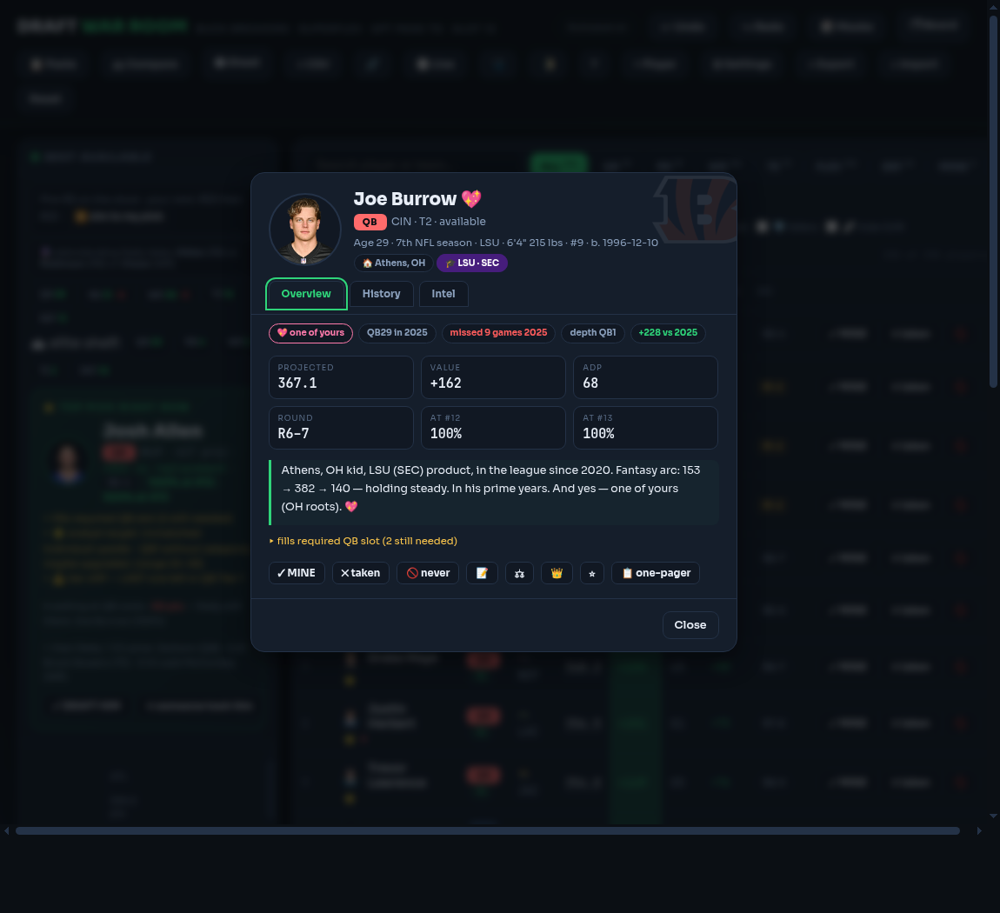

# 🏈 Draft War Room — Buck Breakers Edition




The full draft-day cockpit for **any league shape** (built for a 12-team superflex, 6-pt pass TD, slot 12). Live Sleeper draft sync, real 2026 byes and schedules, three seasons of usage-grade stats on every player. Static site — pushes to `main` auto-deploy on Vercel. Installable PWA, works offline once loaded.

**House key to enter:** the classic. 🔑

## Draft day
Flip **🔴 Live** on when the draft starts: pace clock + ETA, a chime and a panic banner with a one-tap `TAKE <TOP PICK>` when you're on the clock, and confetti + auto-report when your 16th pick lands. Mark every pick (`✓ MINE` / `✕ taken`, `📋 Paste` to catch up, click the pick banner to resync). Keyboard: `/` search · `↑↓` highlight · `M` mine · `T` taken · `D` never · `N` note · `C` compare · `Ctrl+Z/Y` undo/redo · `?` help.

## The engine
Value-over-replacement scaled for superflex scarcity, positional saturation (your 4th QB is worthless, your 3rd is insurance), requirement floors with hard locks, tier cliffs, team-stack boosts with stack-opportunity alerts, analyst targets ⭐, prop-market leans ▲▼, market Edge column, 💎 fallers, and **Monte Carlo survival odds at both of your turn picks** — with CPU teams seeded from the actual pick log and injury-discounted ADP.

## Every player has a story
Hometown (with 💖 favorite-state/college mode — set OH and feel it), college in
school colors, high school, rookie class, three seasons of points and positional
finishes with trend bars, breakout/bust/prime-year tags, and an auto-written
scouting paragraph on every card. Research-mapped against FantasyPros Draft
Wizard, PlayerProfiler, Sleeper and RotoWire — see BESTPRACTICES.md.

## Intelligence
- **🩺 Injury Center** — live ESPN reports (auto-refresh every 5 min) graded Q/D/O/IR, mid-draft change toasts, roster-health warnings, ESPN headlines, Sleeper trending buzz 📈
- **Player cards** — photo, bio (age / seasons / college / size), 2025 actuals vs 2026 projected stat table, positional finish, PPG, depth chart, his QB, playoff-week slate
- **🎲 Mocks** (5 strategies + consensus) · **🎓 Draft Report** (grade, steals, stacks, standings) · **🗂 Board** with real league-mate names, projected standings and a pick-trade calculator · threat board ("4 QB-needy teams before your pick")

## Every-summer data swap
```
./tools/refresh.sh <new-projections.csv> <new-team-board.csv> [last-season]
git add -A && git commit -m "2027 data" && git push
```
That regenerates everything (projections, ADP, playoff slates, headshots, bios, last-season stats, injury snapshot via public Sleeper/ESPN APIs), bumps the PWA cache, and runs the test suite. Mid-season news? Settings → import a projections CSV right in the app.

## Docs
[MANUAL](MANUAL.md) — how to use it · [PREP](PREP.md) — before draft day · [ENGINE](ENGINE.md) — how it thinks · [PERF](PERF.md) · [DATA](DATA.md) · [ARCHITECTURE](ARCHITECTURE.md) · [BESTPRACTICES](BESTPRACTICES.md) · [PRIVACY](PRIVACY.md) · [CONTRIBUTING](CONTRIBUTING.md) · [CHANGELOG](CHANGELOG.md)

## Development
`index.html` + `styles.css` + `app.js` + `data.js`, no build step. `python3 -m http.server` to run locally. CI (GitHub Actions) runs syntax checks, data-sanity tests, engine logic tests in a VM, and a headless-Chrome E2E on every push. The repo's 105 closed issues are the changelog.
